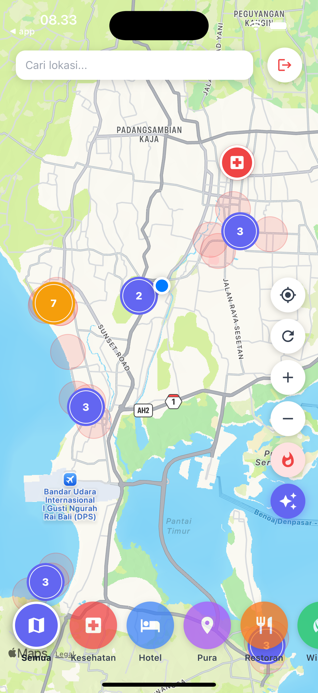
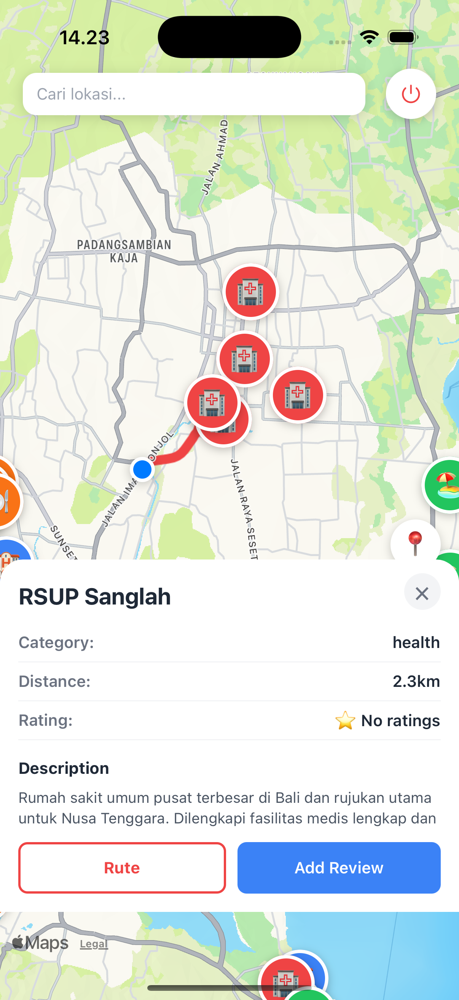

# BaliGuideMap

An interactive map guide for Bali built with React Native (Expo) and Go.

## Features

- **Interactive Map** — browse locations across all Bali regions (Selatan, Utara, Barat, Timur, Nusa Penida)
- **Category Filter** — filter by Wisata, Kesehatan, Hotel, Pura, Restoran
- **Marker Clustering** — nearby markers are grouped at low zoom levels
- **Location Detail** — view name, category, distance, rating, and description
- **Routing** — get directions via driving, walking, or cycling (OSRM, no API key)
- **Search** — real-time search with dropdown results
- **Reviews** — star rating and comment system with authentication
- **GPS** — real-time user location tracking

## Screenshots

| Map View | Location Detail |
|---|---|
|  |  |

## Tech Stack

**Frontend** — React Native (Expo SDK 55), TypeScript, MobX, react-native-maps

**Backend** — Go, Gin, GORM, MySQL

## Getting Started

```bash
# Backend
cd api && go run main.go

# Frontend
cd app && npm install && npx expo run:ios
```

> Requires a development build (`npx expo run:ios`) — not compatible with Expo Go due to native modules.
